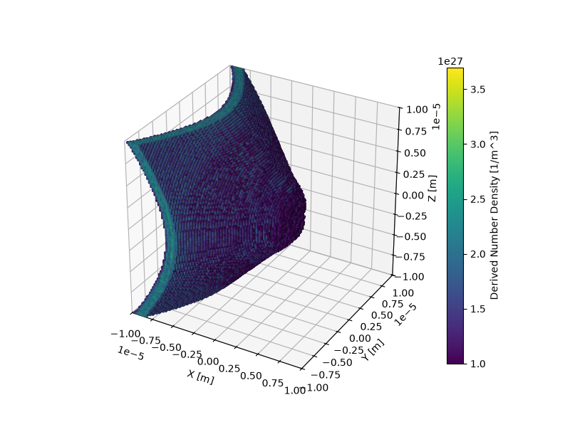

# Plots

You can plot datasets using
[`xarray.DataArray.epoch.plot`](project:#sdf_xarray.dataarray_accessor.EpochAccessor.plot).
This is a custom <project:#sdf_xarray> plotting routine that builds on top of
<inv:#xarray.DataArray.plot>, so you keep the familiar <inv:#xarray> plotting
behaviour while using <project:#sdf_xarray> conveniences (see 
[here](project:#sdf_xarray.dataarray_accessor.EpochAccessor.plot) for details).
Under the hood, plotting is still handled by <inv:#matplotlib>, which means you
can use the full <inv:#matplotlib> API to customise your figure.

| Dimensions | Base plotting function        |        Notes          |
| ---------- | ----------------------------- | --------------------- |
|     1      | <inv:#xarray.plot.line>       |                       |
|     2      | <inv:#xarray.plot.pcolormesh> |                       |
|     3      | <inv:#mpl_toolkits.mplot3d.axes3d.Axes3D.voxels>| Custom functionality built for <project:#sdf_xarray> |
|     >3     | <inv:#xarray.plot.hist>       | Not fully implemented |

## Line plots

One dimensional data will be plotted as a line. Multiple lines can be easily
plotted at the same time.

```{code-cell} ipython3
import sdf_xarray as sdfxr
import matplotlib.pyplot as plt
ds = sdfxr.open_dataset("tutorial_dataset_1d/0010.sdf")
da_1 = ds["Derived_Number_Density_Electron"]
da_2 = ds["Derived_Number_Density_Ion"]
da_1.epoch.plot(label = "Electron")
da_2.epoch.plot(label = "Ion")
plt.legend()
plt.show()
```

## Mesh plots

Two dimensional data will be plotted as a mesh.

```{code-cell} ipython3
ds = sdfxr.open_dataset("tutorial_dataset_2d/0010.sdf")
da = ds["Derived_Number_Density_Electron"]
da.epoch.plot()
```

## Voxel plots

Three dimensional data will be plotted using voxels. This behaviour is not native
to <inv:#xarray>, it has been custom built specifically for this package.

```bash
ds = sdfxr.open_dataset("tutorial_dataset_3d/0000.sdf")
da = ds["Derived_Number_Density"]
da.epoch.plot(vmin = 1e27)
```



```{warning}
Voxel plots can be extremely computationally expensive and may take longer than
expected to plot.
```

Because voxel plots are very expensive, even with relatively small data arrays,
plotting can be sped up by using <project:#sdf_xarray.dataarray_accessor.EpochAccessor.resize>,
which uses interpolation to reduce the resolution.

```{code-cell} ipython3
ds = sdfxr.open_dataset("tutorial_dataset_3d/0005.sdf")
da = ds["Derived_Number_Density"]
da_resized = da.epoch.resize((20, 20, 20))
da_resized.epoch.plot(vmin = 1e27)
```

## Histograms

When the data array has four or more dimensions (or is specified by the user), it will
be plotted as a histogram.

```{code-cell} ipython3
ds = sdfxr.open_dataset("tutorial_dataset_3d/0005.sdf")
da = ds["Derived_Number_Density"]

da.epoch.plot(hist = True)
```